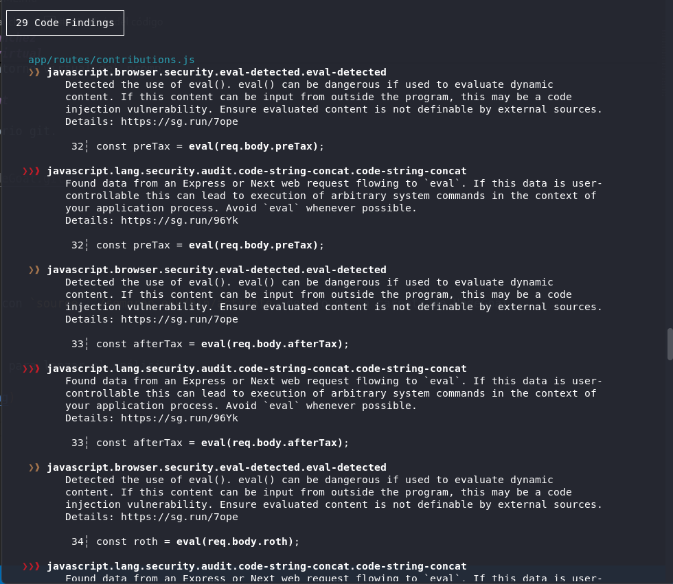

# PPS-Unidad3Actividad23-AdrianCurtoSanchez

## Instalación de Semgrep en entorno virtual

Comenzamos creadndo un entorno virtual de python ejecutando `python3 -m venv semgrep_env`.


Activamos el entorno virtual ejecutando `source semgrep_env/bin/activate`.


Pasamos a instalar semgrep dentro del entorno virtual ejecutando `pip install semgrep`.


Verificamos la instalación con `semgrep --version`.


Para salir del entorno virtual ejecutamos `deactivate`.


Vemos como desaparece el nombre del entorno virtual del promp.

## Crear entorno vulnerble con NodeGoat

Descargamos la aplicación del repositorio git.

```
git clone https://github.com/OWASP/NodeGoat.git
cd NodeGoat
```


## Analisis del código

Volvemos a activar el entorno virtual con `source ../semgrep_env/bin/activate` dentro de la carpeta de NodeGoat.


Y ejecutamos `semgrep --config=auto .` para lanzar el análisis.


Nos muestra que ha encontrado 29 problemas.



Si vamos a cada uno de los problemas nos da un enlace en el cual nos explica cual es el problema encontrado.


## Reglas OWASP Top 10

Podemos decirle a Semgrep que ejecute el análisis top 10 de amenazas contempladas por OWASP ejecutando el siguiente comando:
```
semgrep --config "p/owasp-top-ten" .
```

Detecta 15 vulnerabilidades.


## Integración de Semgrep en GitHub Actions

### Crear proyecto de prueba

Accedemos a GitHub y creamos el repositorio `semgrep-prueba`.

Creamos el repsotiorio en local.


Y creamos el directorio de carpetas:
```
mkdir -p .github/workflows
touch main.py README.md .github/workflows/semgrep.yml
```


Dentro del fichero `main.py` introducimos el siguiente código:
```
# main.py
def main():
    comando = input("Introduce un comando de Python: ")
    eval(comando)  # ⚠️ Uso peligroso de eval()

if __name__ == "__main__":
    main()
```

Y añadimos los siguientes piplines al fichero `semgrep.yml`:
```
name: Semgrep SAST Scan

on:
  push:
    branches:
      - main
      - develop
  pull_request:

jobs:
  semgrep:
    runs-on: ubuntu-latest

    steps:
      - name: Clonar repositorio
        uses: actions/checkout@v4

      - name: Instalar Semgrep
        run: pip install semgrep

      - name: Ejecutar análisis
        run: semgrep --config=auto --json --output=semgrep-results.json

      - name: Mostrar resultados
        run: cat semgrep-results.json

      - name: Guardar reporte
        uses: actions/upload-artifact@v4
        with:
          name: semgrep-report
          path: semgrep-results.json
```

Cremos un commit con las modificacioines y subimos los cambios:
```
git add .
git commit -m "config semgrep actions"
git push
```


Y al acceder a la pestaña `actions` del repositorio veremos como se está ejecutando las acciones programadas en el fichero `semgrep.yml`.


Y podemos descargar el resultado del analisis de semgrep.


## Crear reglas personalizadas

Creamos el archivo `files/custom-rules.yaml` en nuestro repositorio **semgrep-prueba**:

```
rules:
  - id: eval-personalizada
    pattern: eval(...)
    message: "Uso de eval() detectado. Eval puede ser peligroso si se usa con entrada no controlada."
    severity: WARNING
    languages:
      - python

```

## Ejecutar análisis con las reglas personalizadas.

Volvemos a repetir los pasos iniciales de crear el entorno virtual y la instalación semgrep sobre el repositorio **semgrep-prueba** para la realiación de este paso.

Vamos a realizar el análisis estático sobre nuestro repositorio **semgrep-prueba** con el siguiente comando:

```
semgrep --config=files/custom-rules.yaml .
```


## Integración de reglas personalizadas con Github CI/CD

Modificamos la línea del archivo `.github/workflows/semgrep.yml`
```
  run: semgrep --config=auto --json --output=semgrep-results.json
```

por la línea

```
  run: semgrep --config=files/custom-rules.yaml  --json --output=semgrep-results.json
```

Al realizar un `push` en el repositorio con los cambios se ejecuta automáticamente la acción creada.


Si accedemos a los detalles y descargamos el archivo `semgrep-report` con el resultado en formato JSON, podemos ver el resultado de la ejecución:

